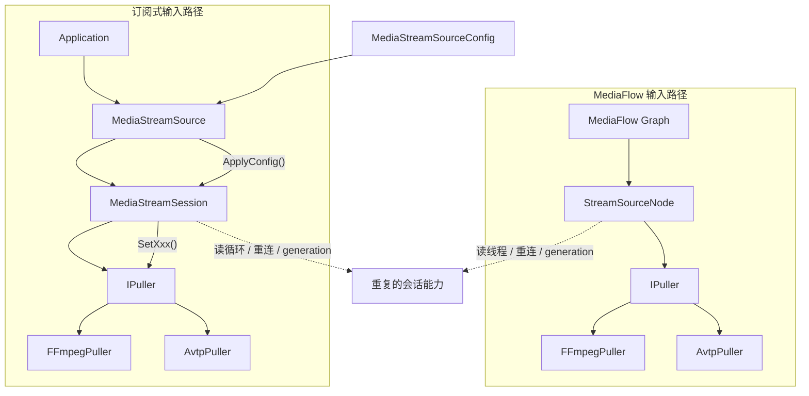
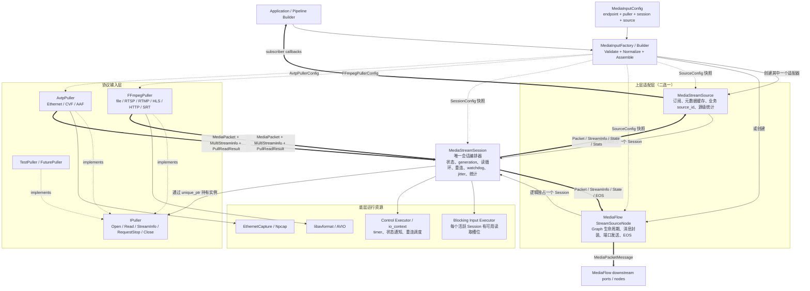
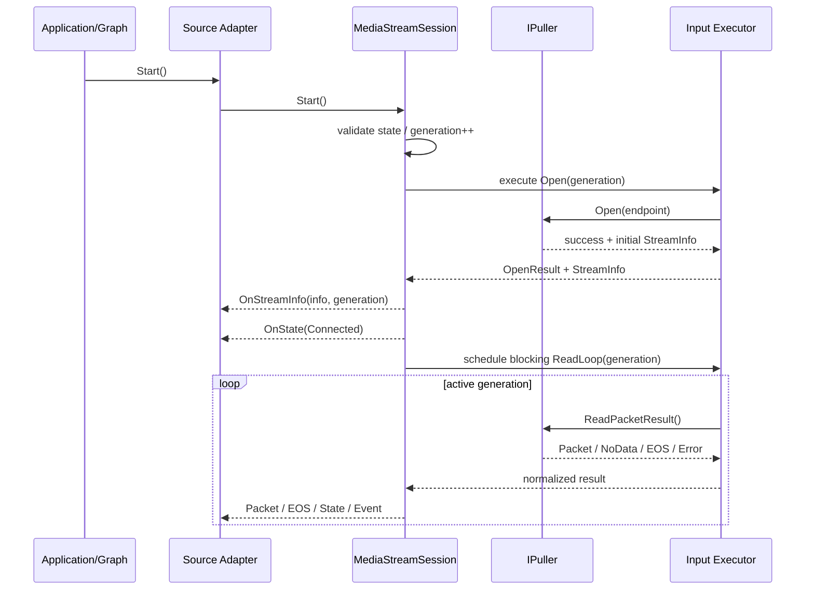
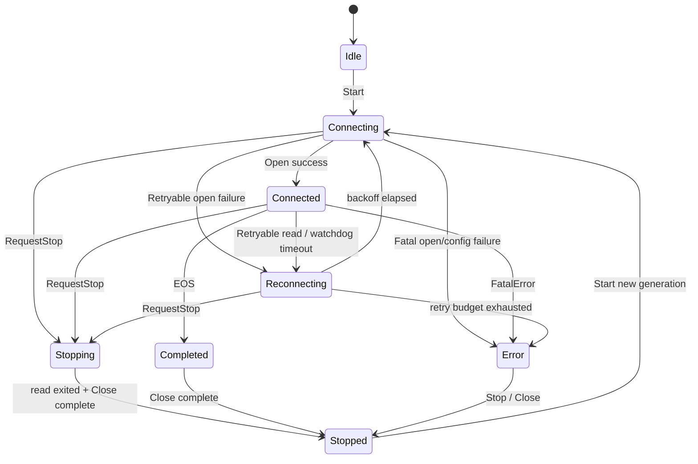
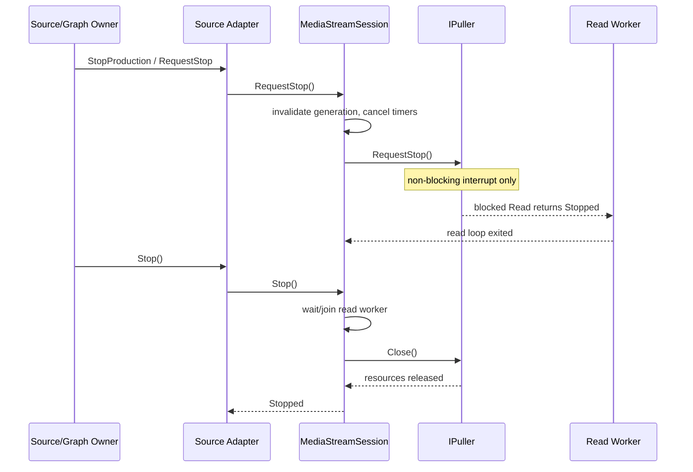

# Media Input、Puller、Session 与 Source 统一架构设计

本文档统一规划 `IPuller`、`FFmpegPuller`、`AvtpPuller`、
`MediaStreamSession`、`MediaStreamSource`、MediaFlow `StreamSourceNode` 以及
`source_config` 的职责、依赖、配置和生命周期。

文档状态：设计草案，不代表当前代码已经实现。

最后更新：2026-08-17。

## 1. 结论

建议将媒体输入链路统一为四层：

1. **配置与装配层**：校验 `MediaInputConfig`，创建具体 Puller，并把各层配置快照
   交给唯一所有者。
2. **协议输入层**：`IPuller` 及其实现只负责打开输入、读取编码包、报告流描述并关闭
   底层资源。
3. **会话编排层**：`MediaStreamSession` 是连接代次、读循环、重连、watchdog、可选
   jitter buffer 和会话统计的唯一实现。
4. **上层适配层**：`MediaStreamSource` 提供订阅式 API；MediaFlow
   `StreamSourceNode` 把同一个 Session 契约适配为 Graph 消息。二者不能再分别实现
   第二套读循环和重连状态机。

核心决策如下：

- 保留一个通用 `FFmpegPuller`，不为 RTSP、RTMP、HLS、SRT 分别创建 Puller。
- 从 `IPuller` 删除协议专用 setter 的长期依赖；具体 Puller 在创建时接收自己的
  结构化配置。
- `MediaStreamSession` 不再依赖完整的 `MediaStreamSourceConfig`，只接收自己的
  `SessionConfig`。
- `MediaStreamSourceConfig` 逐步演进为聚合根 `MediaInputConfig`，包含 endpoint、
  session、puller 和 source 四组配置，但每组配置只由对应层消费。
- RTSP、RTMP、HTTP/HLS、SRT 的 FFmpeg AVOption 必须按协议或 demuxer 作用域构造，
  不能无条件注入。
- 配置在 `Start()` 前完成校验和归一化；运行期间视为不可变快照。需要热更新的字段
  以后逐项定义，不允许依靠任意 setter 隐式生效。
- `RequestStop()` 是非阻塞唤醒契约，`Close()` 是等待 I/O 退出后释放资源的幂等契约。

## 2. 范围与非目标

### 2.1 本文覆盖

- 拉流地址、Puller 类型选择和配置下发。
- FFmpeg 文件、RTSP、RTMP/RTMPS、HTTP/HTTPS、HLS、SRT 输入。
- AVTP 输入的结构化配置接入。
- Puller 的打开、读取、停止、关闭、错误和流信息契约。
- Session 的读循环、连接代次、重连、watchdog、jitter buffer 和统计。
- `MediaStreamSource` 的订阅式输出边界。
- MediaFlow `StreamSourceNode` 与统一 Session 的关系。
- 配置校验、默认值、优先级、敏感字段和扩展 AVOption。
- 分阶段迁移及测试要求。

### 2.2 本文不覆盖

- Decoder、Encoder、Inference、Renderer 和 Publisher 的内部设计。
- MediaFlow Graph、Edge 和 Executor 的完整设计；这里只定义输入节点的接入边界。
- 动态切换 URL、无缝主备流切换和运行中协议变更。
- 自适应码率、转码或 HLS playlist 业务策略。
- FFmpeg、libsrt、Npcap 等第三方库的编译和部署。
- 本文阶段不修改现有 `.h`、`.cpp` 或测试代码。

## 3. 当前实现基线

### 3.1 当前组件

| 组件 | 当前职责 | 当前持有关系 |
|---|---|---|
| `IPuller` | 统一 `Open/ReadPacketResult/GetStreamInfo/RequestStop/Close` 接口，并提供若干默认空实现 setter | 不持有上层对象 |
| `FFmpegPuller` | 使用 libavformat 打开输入、探测轨道、读取 `AVPacket` 并转换为 `MediaPacket` | 持有 `AVFormatContext`、探测 parser、packet pool 和 FFmpeg 配置字段 |
| `AvtpPuller` | 抓取以太网 AVTP 帧、过滤、组帧、时间戳映射并输出 `MediaPacket` | 持有 `EthernetCapture`、assembler、mapper 和 `AvtpPuller::Config` |
| `MediaStreamSession` | 打开 Puller、读循环、重连、watchdog、jitter buffer、会话状态和统计 | `unique_ptr<IPuller>` |
| `MediaStreamSource` | 持有一路业务流、缓存 StreamInfo、桥接 Session 回调并向订阅者分发 | `shared_ptr<MediaStreamSession>` |
| `mediaflow::StreamSourceNode` | 直接打开 Puller、启动独立线程、读包、重连、构造代次消息并发往 Graph | `unique_ptr<IPuller>`，未复用 `MediaStreamSession` |
| `MediaStreamSourceConfig` | 聚合 session 和 puller 字段 | 由 `MediaStreamSource` 保存，启动时向下应用 |

### 3.2 当前关系图

当前存在两条相互独立的输入编排路径：



这两条路径使下面的行为有两套实现：

- Puller 的打开和关闭顺序；
- `PullReadStatus` 到重连/EOS/错误的映射；
- 连接代次；
- 重连次数和等待；
- 阻塞读取线程的停止；
- StreamInfo 刷新；
- 输入统计。

后续如果只在其中一条路径修复协议、停止或重连问题，另一条路径会继续保留旧行为。

### 3.3 当前配置下发情况

`MediaStreamSourceConfig::SessionConfig`：

| 字段 | 当前消费方 | 当前状态 |
|---|---|---|
| `connect_timeout_ms` | `MediaStreamSession::ApplyPullerConfig()` 转给 Puller | 已使用，但配置所有权放错层 |
| `read_timeout_ms` | 同上 | 已使用，但同时存在 `puller.io_timeout_ms` |
| `reconnect_interval_ms` | `MediaStreamSession` | 已使用 |
| `max_reconnect_count` | `MediaStreamSession` | 已使用 |
| `watchdog_interval_ms` | `MediaStreamSession` | 已使用，但一个值同时表达检查周期和 idle 阈值 |
| `jitter_buffer_interval_ms` | `MediaStreamSession` | 已使用 |
| jitter capacity/min/max/safety/alpha | `AdaptiveJitterBuffer` | 已使用 |

`MediaStreamSourceConfig::MediaPullerConfig`：

| 字段 | 当前状态 | 问题 |
|---|---|---|
| `io_timeout_ms` | 未下发 | 与 session connect/read timeout 重复 |
| `low_latency` | 下发给 `FFmpegPuller` | 对所有协议无条件应用 |
| `max_delay_ms` | 未下发 | 含义和作用层不明确 |
| `dump_packets` | 未下发 | 诊断配置没有实现 |
| `rtsp_transport` | 下发 | RTSP 字段进入通用 `IPuller` |
| `rtsp_auto_switch_tcp` | 下发 | 名称暗示运行时切换，但 FFmpeg option 只能表达有限的传输候选/偏好 |
| `rtsp_auto_switch_timeout_ms` | 下发 | 被混入通用 open timeout 计算 |
| `username/password` | 下发为 FFmpeg `user/password` option | 不是 FFmpeg 8.1 的通用认证方式，协议间语义不同 |
| `headers` | 未下发 | HLS/HTTP 无法使用已有配置 |
| `socket_buffer_size` | 未下发 | RTSP 与 SRT 对应的 FFmpeg option 名不同 |

### 3.4 当前主要问题

#### 3.4.1 `IPuller` 泄漏 RTSP 细节

`IPuller` 提供 `SetRtspTransport()`、`SetRtspAutoSwitchToTcp()` 等默认空实现。
这会产生两个问题：

- AVTP 或测试 Puller 被迫看到与自身无关的协议概念；
- 调用方无法知道配置是已应用还是被默认空实现静默忽略。

#### 3.4.2 `FFmpegPuller::Open()` 无条件注入 RTSP option

当前实现对所有 URL 设置 `rtsp_transport`、`stimeout` 和 `timeout`。FFmpeg 的 option
按 demuxer/protocol 解释，同名字段在不同协议中可能单位或语义不同：

- RTSP 的 `timeout` 是 socket I/O 微秒；
- SRT 的 `timeout` 也是微秒，但还有独立 `connect_timeout` 毫秒；
- RTMP 的 `timeout` 是监听模式等待秒数，不是通用读取超时；
- HLS 同时涉及 HLS demuxer 和 HTTP/HTTPS protocol option。

因此不能把一份字典无条件用于所有协议。

#### 3.4.3 配置对象越层下发

`MediaStreamSession::ApplyPullerConfig(const MediaStreamSourceConfig&)` 让 Session 依赖
整个 Source 配置，并负责解释 Puller 字段。这破坏了“配置由所有者消费”的边界。

#### 3.4.4 `Start()` 隐式应用配置

`MediaStreamSource::Start()` 内部调用 `ApplyConfig()`。如果配置非法，错误会延迟到启动
或底层 FFmpeg；如果重复 Start，配置是否重新生效也不清晰。目标设计应在装配阶段完成
校验和归一化，`Start()` 只执行生命周期动作。

#### 3.4.5 Session 与 MediaFlow SourceNode 重复

`MediaStreamSession` 和 `StreamSourceNode` 都直接拥有 Puller，并分别实现读循环和重连。
这是当前最需要统一的结构问题，比单独整理 FFmpeg 字段更重要。

#### 3.4.6 阻塞 I/O 与控制调度混用

`MediaStreamSession` 把一次可能阻塞的 `ReadPacketResult()` post 到外部
`io_context`。如果该 `io_context` 工作线程不足，timer、Stop 或其他 Session 可能被阻塞。
目标架构应明确阻塞读取的执行资源，而不是依赖调用方“恰好提供足够线程”。

## 4. 目标架构

### 4.1 总体关系图

下图同时表示所有权、配置流、控制流和媒体数据流。实线表示对象所有权或调用，虚线表示
配置快照，粗粒度向上箭头表示数据/事件。一个实际输入实例只选择
`MediaStreamSource` 或 `StreamSourceNode` 其中一个上层适配器。



### 4.2 依赖方向

目标依赖方向固定为：

```text
Application / MediaFlow
        -> Source adapter
        -> MediaStreamSession
        -> IPuller
        -> concrete protocol/library
```

禁止反向依赖：

- Puller 不包含 Session、Source 或 MediaFlow 头文件。
- Session 不包含 `MediaStreamSource`、`StreamSourceNode` 或完整聚合配置。
- Source adapter 不解释 FFmpeg AVOption。
- 配置结构不持有运行时 socket、FFmpeg context、callback 或 executor。

## 5. 抽象层职责与边界

### 5.1 配置与装配层

建议引入 `MediaInputFactory` 或等价 Builder。它负责：

- 校验 root config；
- 归一化 duration、枚举、默认值和 URL；
- 根据显式 `PullerKind` 或有限 Auto 规则创建 Puller；
- 把具体配置传给具体 Puller 构造函数；
- 创建并配置 Session；
- 创建订阅式 Source 或 MediaFlow SourceNode；
- 返回包含错误码和消息的构建结果。

它不负责：

- 打开网络；
- 启动线程或 timer；
- 读取媒体包；
- 运行时重连；
- 动态修改配置。

推荐由装配层解决当前“先创建 Session，再逐个 setter，再注入 Puller，再由 Source 启动时
补下发配置”的顺序依赖。

### 5.2 `IPuller`

`IPuller` 是单次底层输入连接的最小协议契约。

负责：

- 使用已经保存的具体配置打开一个 endpoint；
- 同步读取一个编码媒体包或返回结构化状态；
- 提供当前连接的 `MultiStreamInfo` 快照；
- 非阻塞请求终止当前阻塞 I/O；
- 幂等关闭并释放底层资源；
- 报告底层 native error 和必要的异步协议事件。

不负责：

- 重连次数、退避或主备地址；
- Session 状态机和 generation；
- 上层订阅者；
- Graph 消息、EOS message 或 Edge 背压；
- Decoder/Encoder；
- 通用业务统计；
- 对不属于自身的配置做默认空处理。

目标契约约束：

| 方法/结果 | 契约 |
|---|---|
| `Open(endpoint)` | 同步；重复打开前允许内部先关闭旧连接；失败时不得遗留半开资源 |
| `ReadPacketResult()` | 同一实例最多一个并发调用；`Packet` 必须携带非空 packet |
| `NoData` | 暂时没有可交付包，不代表 EOF 或重连；调用方应避免忙循环 |
| `EOS` | 有限输入正常结束，不得默认重连 |
| `RetryableError` | 当前连接不能继续，但重新 Open 可能恢复 |
| `FatalError` | 当前配置/格式/数据不可恢复，Session 进入 Error |
| `Stopped` | 由本地主动停止触发，不计为输入故障 |
| `RequestStop()` | 线程安全、非阻塞、可重复调用，只负责唤醒/中断读取 |
| `Close()` | 幂等；等待读取退出后释放资源；不得再产生 packet callback |
| `GetStreamInfo()` | 返回线程安全快照；允许首批包到达后补齐元数据 |

建议长期删除 `IPuller` 中的 `SetRtspXxx()` 和其他默认空 setter。通用接口不应该通过
“调用成功但可能什么都没做”来表达能力。

### 5.3 `FFmpegPuller`

`FFmpegPuller` 是 libavformat 输入适配器，而不是 RTSP Puller。

负责：

- 根据 URL、可选 input format 和结构化配置构造 `AVDictionary`；
- 设置 FFmpeg interrupt callback；
- `avformat_open_input()`、`avformat_find_stream_info()`；
- 将音视频 `AVStream` 转换为工程 `MultiStreamInfo`；
- 将 `AVPacket` 零拷贝包装为 `MediaPacket`；
- 为元数据不完整的压缩视频执行有界 parser probe；
- 将 FFmpeg 错误映射为 `PullReadStatus`。

不负责：

- Session 重连；
- 运行时 UDP 到 TCP 的业务状态机；
- HTTP/HLS playlist 业务选择；
- 把所有协议认证统一成 `user/password` AVOption；
- 为调用方猜测未声明的危险协议 option。

`VideoProbeContext` 本质是通用压缩视频元数据探测，不是 RTSP 专属能力；只需把注释从
“某些 RTSP 会话”扩展为“某些 live/network input”。

### 5.4 `AvtpPuller`

`AvtpPuller` 继续保留具体的 `AvtpPullerConfig`，因为设备、MAC、stream id、CVF/AAF、
Npcap queue 和 AVTP timestamp 都没有 FFmpeg 对应语义。

负责：

- AVTP URL 兼容解析；
- EthernetCapture 生命周期；
- BPF 和 source/stream filter；
- CVF/AAF 解析和 access unit 组装；
- AVTP 时间戳映射；
- AVTP 级统计。

不负责 Session 重连、订阅和 Graph 输出。

结构化配置应为主入口，URL query 只作为兼容输入。两者同时出现时必须有明确优先级，
不能让同一个字段有两个不透明来源。

### 5.5 `MediaStreamSession`

Session 是一次逻辑媒体输入会话的唯一编排器。一次 Session 可以经历多个底层连接代次。

负责：

- 持有一个已配置 Puller；
- 保存 endpoint 和 `SessionConfig` 快照；
- Start/RequestStop/Stop 生命周期；
- connection generation；
- 单一读循环；
- 把 `PullReadStatus` 映射为继续、EOS、重连或 Error；
- 重连次数和退避；
- idle watchdog；
- 可选 jitter/reorder；
- 连接、包、字节、码率、重连、错误和丢包统计；
- 向上层发布 packet、StreamInfo、state 和 event。

不负责：

- 解释 FFmpeg/AVTP 配置；
- 选择具体 Puller 类型；
- 保存完整 `MediaInputConfig`；
- 管理多个业务订阅者；
- 构造 MediaFlow message；
- Decoder、Graph、Edge 或 Publisher 生命周期。

Session 的回调建议表达为观察者或单一上层 sink，避免 Session 自己演变为第二个 Source。

### 5.6 `MediaStreamSource`

`MediaStreamSource` 是非 MediaFlow 场景的一路业务源 façade。

负责：

- 稳定业务 `source_id`；
- 持有一个 Session；
- 启动/停止时委托 Session；
- 缓存最新 StreamInfo 和 Session 状态；
- 管理多个 packet/StreamInfo/state 订阅者；
- 提供源级聚合统计或周期打印。

不负责：

- 逐项向下设置 Puller 配置；
- 解释协议；
- 实现重连、watchdog 或 jitter；
- 拥有第二个读线程；
- 处理 Decoder 或下游背压。

目标状态下应删除 `Start()` 中的隐式 `ApplyConfig()`。Source 接收到的应是已经装配完成的
Session 和自身 `SourceConfig` 快照。

### 5.7 MediaFlow `StreamSourceNode`

`StreamSourceNode` 是 Session 到 MediaFlow 的 adapter，不再直接拥有 Puller。

负责：

- 接入 Graph Init/Start/StopProduction/Stop/Deinit 生命周期；
- 把 Session packet 转为 `MediaPacketMessage`；
- 附加稳定 stream id、generation 和每轨 sequence；
- 刷新并关联 `MediaStreamInfo`；
- 向 video/audio 端口发送；
- 把 Session EOS 转为 Graph EOS message；
- 遵守 Graph graceful stop 和背压约束。

不负责：

- 打开或直接关闭 Puller；
- 自己实现 reconnect loop；
- 自己计算 Puller 错误分类；
- 自己保存 FFmpeg/AVTP 配置。

这样订阅式路径和 MediaFlow 路径共享完全相同的底层输入行为，仅输出适配方式不同。

## 6. 目标配置模型

### 6.1 聚合根

建议将现有 `MediaStreamSourceConfig` 演进为下面的聚合根。名称可以分阶段迁移；第一阶段
可以保留旧名称，最终推荐 `MediaInputConfig`，因为它不仅服务于
`MediaStreamSource`，也服务于 MediaFlow SourceNode。

```cpp
struct MediaInputConfig {
    InputEndpointConfig endpoint;
    PullerConfig puller;
    SessionConfig session;
    SourceConfig source;

    ConfigResult Validate() const;
};
```

设计规则：

- root config 只用于装配和序列化；
- 每个运行时对象只保存自己的子配置快照；
- 校验返回结构化错误，不依赖启动日志；
- duration 在配置 API 中使用 `std::chrono`，仅在配置文件边界使用 `_ms/_us`；
- 可选字段使用 `std::optional`，避免默认值被误认为调用方显式选择；
- secrets 支持外部 secret reference，日志只显示是否配置，不显示值。

### 6.2 Endpoint 配置

```cpp
enum class PullerKind {
    Auto,
    FFmpeg,
    Avtp,
};

struct InputEndpointConfig {
    std::string uri;
    PullerKind puller_kind{PullerKind::Auto};
};
```

Auto 规则应保持有限且可测试：

| URI | Auto 结果 |
|---|---|
| `avtp://...` | `AvtpPuller` |
| `file://...` 或普通文件路径 | `FFmpegPuller` |
| `rtsp/rtmp/rtmps/http/https/srt/...` | `FFmpegPuller` |
| 未知 scheme | 校验失败，要求显式类型或扩展 factory |

生产配置建议显式指定 `puller_kind`，Auto 主要用于兼容和工具程序。

### 6.3 Puller 配置

```cpp
using PullerSpecificConfig = std::variant<
    FFmpegPullerConfig,
    AvtpPullerConfig
>;

struct PullerConfig {
    PullerSpecificConfig specific;
};
```

不要再建立一份包含 RTSP、AVTP 和未来所有协议字段的扁平 `MediaPullerConfig`。variant
使“选择 FFmpeg 却传入 AVTP 配置”成为可校验错误。

### 6.4 FFmpeg 通用配置

```cpp
enum class LatencyMode {
    Auto,
    Normal,
    Low,
};

struct FFmpegIoConfig {
    std::chrono::milliseconds connect_timeout{5000};
    std::chrono::milliseconds read_timeout{10000};
};

struct FFmpegProbeConfig {
    std::optional<std::int64_t> probe_size_bytes;
    std::optional<std::chrono::microseconds> analyze_duration;
    int max_video_probe_packets{120};
    std::chrono::milliseconds video_probe_timeout{3000};
};

struct FFmpegPullerConfig {
    FFmpegIoConfig io;
    FFmpegProbeConfig probe;
    LatencyMode latency{LatencyMode::Auto};
    std::optional<std::string> input_format;

    std::optional<RtspInputOptions> rtsp;
    std::optional<HttpInputOptions> http;
    std::optional<HlsInputOptions> hls;
    std::optional<RtmpInputOptions> rtmp;
    std::optional<SrtInputOptions> srt;

    std::map<std::string, std::string> extra_av_options;
    PullerDiagnosticsConfig diagnostics;
};
```

通用 timeout 使用 interrupt callback 实现，避免依赖协议间不一致的同名 option。
只有协议明确支持且语义一致时，option builder 才额外写入协议 timeout。

`extra_av_options` 是必要的逃生口，但不是常用配置主入口：

- 常用且影响安全/单位/行为的字段应类型化；
- extra option 最后合并，显式覆盖类型化 option；
- 冲突覆盖必须记录 option 名；
- 打开后检查未消费 option；
- `password/passphrase/token/authorization/cookie` 等值必须脱敏。

### 6.5 RTSP 配置

建议字段：

| 语义字段 | FFmpeg 8.1 映射 | 说明 |
|---|---|---|
| `transport` | `rtsp_transport` | `udp/tcp/udp_multicast/http/https` 或明确候选 flags |
| `prefer_tcp` | `rtsp_flags=prefer_tcp` | 表达建立连接时偏好，不宣称运行中无缝切换 |
| `socket_timeout` | `timeout`，微秒 | 只对 RTSP 写入 |
| `reorder_queue_size` | `reorder_queue_size` | 可选，默认交给 FFmpeg |
| `receive_buffer_bytes` | `buffer_size` | RTSP 底层 socket buffer |
| `min_port/max_port` | 同名 option | UDP 端口范围 |
| `user_agent` | `user_agent` | 可选 |
| TLS fields | `ca_file/tls_verify/...` | 仅 RTSPS/HTTPS tunnel 等相关场景 |

现有 `rtsp_auto_switch_tcp` 与 `rtsp_auto_switch_timeout_ms` 不应原样进入新模型。

- 如果需求只是建立阶段允许 UDP/TCP 候选，应使用 `rtsp_transport` flags 和
  `prefer_tcp` 明确表达。
- 如果需求是 UDP 已经工作后因读超时重新使用 TCP，这是一次新的连接代次，应单独设计
  `RtspTransportFallbackPolicy`，由 Puller 提供有效连接 profile，Session 仍只执行通用
  reconnect。不能把它描述为 FFmpeg 自动在当前连接内切换。

### 6.6 HTTP 与 HLS 配置

HLS 通常使用 `http://` 或 `https://`，因此 protocol 和 demuxer 配置必须同时存在。

HTTP 配置建议：

| 语义字段 | FFmpeg option |
|---|---|
| headers | `headers`，序列化为规范 CRLF header block |
| user agent | `user_agent` |
| referer | `referer` |
| cookies | `cookies` |
| proxy | `http_proxy` |
| persistent connection | `multiple_requests` |
| reconnect | `reconnect` |
| network reconnect | `reconnect_on_network_error` |
| HTTP status reconnect | `reconnect_on_http_error` |
| streamed reconnect | `reconnect_streamed` |
| retry limits | `reconnect_max_retries`、delay fields |
| TLS verify | TLS protocol对应 option |

HLS 配置建议：

| 语义字段 | FFmpeg option |
|---|---|
| live start index | `live_start_index` |
| prefer EXT-X-START | `prefer_x_start` |
| playlist reload limits | `max_reload`、`m3u8_hold_counters` |
| persistent HTTP | `http_persistent` |
| parallel segment fetch | `http_multiple` |
| segment retry | `seg_max_retry` |

不要只根据 `.m3u8` 后缀判断 HLS；signed URL 可能没有明显扩展名。调用方可以显式设置
`input_format="hls"` 或提供 HLS options，FFmpeg 最终仍负责格式探测。

### 6.7 RTMP 配置

建议类型化：

| 语义字段 | FFmpeg option |
|---|---|
| live mode | `rtmp_live=any/live/recorded` |
| client buffer | `rtmp_buffer`，毫秒 |
| application/playpath | `rtmp_app`、`rtmp_playpath` |
| subscribe | `rtmp_subscribe` |
| flash/page/swf data | 对应 `rtmp_*` option |
| TCP_NODELAY | `tcp_nodelay` |

不能把通用 `read_timeout_ms * 1000` 写入 RTMP 的 `timeout`；FFmpeg 8.1 中该 option
属于 RTMP listen 等待语义。

### 6.8 SRT 配置

建议类型化：

| 语义字段 | FFmpeg option / 单位 |
|---|---|
| mode | `mode=caller/listener/rendezvous` |
| connect timeout | `connect_timeout`，毫秒 |
| I/O timeout | `timeout`，微秒 |
| latency | `latency/rcvlatency/peerlatency`，微秒 |
| stream id | `streamid` |
| passphrase/key length | `passphrase/pbkeylen` |
| transmission type | `transtype=live/file` |
| receive/send buffer | `recv_buffer_size/send_buffer_size` 或 libsrt buffer option |
| payload size | `payload_size` |

SRT passphrase 必须作为 secret 处理，不能出现在普通配置 dump、错误消息或未脱敏 URL 中。

### 6.9 AVTP 配置

现有 `AvtpPuller::Config` 已接近正确边界，建议移动/别名为独立
`AvtpPullerConfig`，保留以下字段：

- device；
- source MAC；
- stream id；
- payload format；
- pcap queue size；
- capture read timeout；
- promiscuous；
- width/height/fps fallback；
- audio enable/codec/sample rate/channels；
- timestamp mode；
- probe on open、timeout 和 packet limit。

URL query 解析应先生成同一个结构，再调用统一 Validate/Normalize，不再维护第二套行为。

### 6.10 Session 配置

```cpp
struct ReconnectPolicy {
    bool enabled{true};
    int max_attempts{-1};
    std::chrono::milliseconds initial_delay{3000};
    double multiplier{1.0};
    std::chrono::milliseconds max_delay{3000};
    std::chrono::milliseconds reset_after_stable{30000};
};

struct WatchdogConfig {
    bool enabled{false};
    std::chrono::milliseconds check_interval{1000};
    std::chrono::milliseconds idle_timeout{10000};
};

struct SessionJitterConfig {
    bool enabled{false};
    std::chrono::milliseconds release_interval{5};
    std::size_t capacity_packets{512};
    std::chrono::milliseconds min_delay{20};
    std::chrono::milliseconds max_delay{200};
    std::chrono::milliseconds safety_margin{10};
    double alpha{0.9};
};

struct SessionConfig {
    ReconnectPolicy reconnect;
    WatchdogConfig watchdog;
    SessionJitterConfig jitter;
    std::chrono::milliseconds no_data_backoff{1};
};
```

配置归属说明：

- connect/read timeout 属于 Puller I/O，不属于 Session reconnect；
- retry 次数和等待属于 Session；
- watchdog 的检查周期和 idle 阈值必须拆开；
- jitter buffer 是连接上方、Source 下方的包时序策略，属于 Session；
- MediaFlow Edge queue 是背压和调度边界，不是网络 jitter buffer，两者不能混为一项配置；
- `NoData` backoff 防止本地 parser/filter 场景形成忙循环。

### 6.11 Source 配置

```cpp
struct SourceConfig {
    std::string source_id;
    std::optional<std::uint64_t> numeric_stream_id;
    bool cache_stream_info{true};
    std::chrono::seconds stats_log_interval{0};
};
```

订阅回调本身是运行时对象，不进入可序列化配置。MediaFlow 端口和 Edge 配置属于 Graph，
也不进入 `MediaInputConfig::source`。

### 6.12 配置所有权矩阵

| 配置 | 校验/归一化 | 运行时所有者 | 其他层是否可解释 |
|---|---|---|---|
| endpoint URI / PullerKind | Factory | Session 保存 URI；类型只用于构建 | Source 可展示但不修改 |
| FFmpeg common/protocol options | Factory + FFmpeg config validator | `FFmpegPuller` | Session/Source 不解释 |
| AVTP options | Factory + AVTP validator | `AvtpPuller` | Session/Source 不解释 |
| reconnect policy | Factory | `MediaStreamSession` | Puller 不解释 |
| watchdog | Factory | `MediaStreamSession` | Puller 不解释 |
| jitter | Factory | `MediaStreamSession` | Source/Graph 不解释 |
| source identity / source stats | Factory | Source adapter | Session/Puller 不解释 |
| Graph port/edge/backpressure | PipelineBuilder | `StreamSourceNode`/Graph | 不进入 input config |

### 6.13 配置优先级

建议固定以下合并顺序，从低到高覆盖：

1. 组件内部安全默认值；
2. 从 endpoint URI 中归一化出的已知参数；
3. 结构化 common config；
4. 结构化 protocol/demuxer config；
5. `extra_av_options`。

结构化配置是工程配置的权威来源。URI query 与结构化配置发生同名冲突时，不能把原始
URI 不加处理地交给 FFmpeg 再由底层静默决定。Normalizer 应移除已经结构化接管的已知
query，或者明确拒绝冲突；对 passphrase、mode、latency 等高风险字段建议直接拒绝
双重来源。无法安全重写的签名 URL 保持原样，其冲突字段必须由调用方消除。

## 7. FFmpeg option 构造边界

### 7.1 推荐内部组件

建议在 `FFmpegPuller` 内部建立不可公开依赖 FFmpeg 类型的 option builder：

```text
FFmpegPullerConfig
  -> ValidateFFmpegConfig()
  -> DetectInputScope(uri, optional format)
  -> ApplyCommonFormatOptions()
  -> ApplyProtocolOptions(rtsp/http/rtmp/srt/...)
  -> ApplyDemuxerOptions(hls/...)
  -> ApplyExtraOptions()
  -> avformat_open_input()
  -> ReportUnconsumedOptionNames()
```

protocol 可通过 FFmpeg `avio_find_protocol_name()` 或经过测试的 URI parser 识别；HLS 等
demuxer 由显式 format hint 和 FFmpeg 探测共同决定。

### 7.2 timeout 原则

timeout 分为三类，不能合并为一个 `io_timeout_ms`：

| timeout | 所有者 | 实现 |
|---|---|---|
| 打开总时限 | FFmpegPuller | interrupt callback 在 Open/probe 阶段检查 connect timeout |
| 单次阻塞读取时限 | FFmpegPuller | 每次 `av_read_frame()` 前重置 interrupt deadline |
| 无成功媒体包 idle 时限 | Session | watchdog，根据最后成功 packet 时间判断 |
| 重连等待 | Session | timer/backoff，不占用 Puller |
| 协议 native timeout | 具体 protocol option builder | 仅在语义和单位明确时补充 |

### 7.3 low latency 原则

`low_latency=true` 不应继续作为对所有输入强制设置 `fflags=nobuffer` 的布尔开关。

- `Auto`：不主动覆盖 FFmpeg 默认，或按已验证协议 profile 应用。
- `Normal`：保留 demuxer 正常缓冲和探测。
- `Low`：调用方明确接受更弱的抗抖和探测能力后才设置低延迟 option。

HLS、文件和需要充分 probe 的输入不应继承 RTSP 摄像头的默认低延迟策略。

### 7.4 未消费 option

`avformat_open_input()` 返回后，传入字典中未消费的键应被检查：

- 严格模式：未知 option 导致 Open 失败，适合生产配置校验；
- 兼容模式：记录 warning 并继续，适合迁移期；
- 日志只打印 option 名和来源，不打印敏感值。

这可以发现拼写错误、当前 FFmpeg 版本不支持的参数以及 option 被应用到错误协议。

## 8. 生命周期与并发

### 8.1 启动时序



关键约束：

- `Start()` 不再逐项应用配置；配置在对象创建前已经校验；
- 初始 StreamInfo 在 Connected 前发布；
- 首批 packet 恢复宽高后，Session 允许再次发布更新后的 StreamInfo；
- blocking read 不占用只用于 timer/control 的唯一线程。

### 8.2 Session 状态机



建议把当前 `KSTOPPED` 同时表示主动停止和 EOS 的语义拆开：

- `Completed` 表示有限输入正常结束；
- `Stopped` 表示资源已经关闭；
- `Error` 表示需要上层处理的终止错误。

### 8.3 generation

Session generation 是底层连接代次：

- 每次初始 Start 产生非零 generation；
- 每次成功重连使用新的 generation；
- Stop 立即使旧 generation 失效；
- 所有 packet、StreamInfo、state/event 通知携带 generation；
- Source adapter 不自行维护第二套连接 generation；
- MediaFlow 每轨 sequence 在新的 generation 从 1 重新开始；
- 稳定业务 `source_id/stream_id` 在 generation 变化时保持不变。

### 8.4 停止时序



必须保证：

- `RequestStop()` 不等待 `io_mutex`、线程 join 或网络 close；
- `Close()` 之前读取线程已经退出，或者 Puller 内部有明确互斥保证；
- `Close()` 可重复调用；
- Stop 后不得继续向 Source/Graph 分发旧 generation 消息；
- MediaFlow graceful stop 可以先停止生产，再等待下游 drain，最后执行完整 Close。

### 8.5 执行资源

推荐把执行资源分成：

| 资源 | 工作 |
|---|---|
| Input worker/executor | `Open()` 和阻塞 `ReadPacketResult()`；容量至少覆盖允许同时阻塞的活跃 Session |
| Control `io_context` | reconnect timer、watchdog timer、状态通知和轻量控制逻辑 |
| Subscriber/Graph executor | 上层回调或消息发送；慢订阅者不能阻塞 Puller read worker |

实现可以是一 Session 一线程，也可以是明确容量的 blocking pool；不能复用一个只有单线程的
control executor 来承载无限期网络 read。

## 9. 错误、事件与统计

### 9.1 Puller 错误模型

建议在保留 `PullReadStatus` 的基础上增加结构化错误：

```cpp
enum class PullErrorCategory {
    None,
    Cancelled,
    Timeout,
    Authentication,
    NotFound,
    UnsupportedProtocol,
    InvalidConfiguration,
    InvalidMedia,
    Network,
    EndOfInput,
    Internal,
};

struct PullError {
    PullErrorCategory category;
    int native_code;
    std::string message;
    bool retryable;
};
```

Session 依据 `retryable` 和 status 决定重连，不解析 FFmpeg 错误字符串。

### 9.2 事件边界

| 事件 | 产生方 | 消费方 |
|---|---|---|
| protocol warning/auth/format event | Puller | Session 转发并加 source/generation context |
| connection state | Session | Source adapter/Application |
| reconnect scheduled/attempted/exhausted | Session | Source adapter/metrics |
| StreamInfo initial/updated | Puller -> Session | Source adapter/Decoder setup |
| packet/EOS | Puller -> Session | Source adapter |
| subscriber/edge rejection | Source adapter/Graph | 上层 metrics，不回写 Puller |

### 9.3 统计分层

| 层 | 统计内容 |
|---|---|
| FFmpegPuller | open/read native errors、unconsumed options、probe packets/time、各轨包数 |
| AvtpPuller | raw/parsed/filtered/error/access-unit、assembler、timestamp mapper |
| Session | bytes、packets、bitrate、connection duration、reconnect、idle timeout、jitter drop |
| MediaStreamSource | subscriber count、回调拒绝/耗时、业务源累计统计 |
| StreamSourceNode/Graph | output accepted/rejected、Edge dropped、sequence gap、EOS delivery |

统计不能跨层重复累计后又使用相同名称。例如 Puller native packet 与 Session delivered
packet 应分别命名，避免排查过滤或 jitter drop 时无法对账。

## 10. 建议接口轮廓

以下只表达边界，不是本阶段代码清单：

```cpp
class IPuller {
public:
    virtual ~IPuller() = default;
    virtual OpenResult Open(const InputEndpoint& endpoint) = 0;
    virtual PullReadResult ReadPacketResult() = 0;
    virtual MultiStreamInfo GetStreamInfo() const = 0;
    virtual void RequestStop() = 0;
    virtual void Close() = 0;
};

class MediaStreamSession {
public:
    MediaStreamSession(InputEndpoint endpoint,
                       SessionConfig config,
                       std::unique_ptr<IPuller> puller,
                       InputExecutor& input_executor,
                       ControlExecutor& control_executor);

    StartResult Start();
    void RequestStop();
    void Stop();
    SessionSnapshot Snapshot() const;
    Subscription SetSink(std::shared_ptr<IMediaInputSink> sink);
};
```

具体 Puller 配置通过构造/Factory 注入：

```cpp
std::unique_ptr<IPuller> CreatePuller(const PullerConfig& config);
```

不建议在 `IPuller` 上增加：

```cpp
SetRtspTransport(...);
SetHlsHeaders(...);
SetSrtLatency(...);
SetAvOption(...);
```

这些调用会重新制造协议泄漏和运行期配置不确定性。

## 11. 迁移计划

迁移必须保持每一步可构建、可测试，不建议一次性替换所有接口。

### 阶段 0：建立行为基线

- 为 `IPuller::PullReadStatus` 全部分支建立 Session 测试；
- 固化 Start/Stop/RequestStop/Close 幂等和并发测试；
- 记录订阅式 Source 与 MediaFlow SourceNode 当前重连/EOS 行为差异；
- 为 `MediaStreamSourceConfig` 每个字段建立“已消费/未消费”基线；
- 不改变生产行为。

Gate：现有本地文件、RTSP TCP/UDP、AVTP 和 MediaFlow 测试均有明确基线。

### 阶段 1：FFmpeg option 作用域修复

- 引入内部 URL/protocol/demuxer scope 判定；
- 只对 RTSP 输入写 RTSP option；
- connect/read timeout 统一由 interrupt deadline 兜底；
- 检查未消费 option；
- 保持旧 setter 对外兼容。

Gate：本地文件、RTSP、HTTP/HLS、RTMP、SRT 的 option builder 测试证明不会串协议。

### 阶段 2：结构化 Puller 配置

- 新增 `FFmpegPullerConfig`、协议子配置和 `AvtpPullerConfig`；
- 新增 `PullerConfig` variant 和 Factory；
- 旧 setter 转为兼容适配并标记废弃；
- 明确 URL query 与结构化字段优先级；
- 增加敏感字段脱敏。

Gate：所有配置在 Open 前可 Validate；未知/冲突 option 有明确错误。

### 阶段 3：Session 配置解耦

- `MediaStreamSession` 只接收 `SessionConfig`；
- 删除其对完整 `MediaStreamSourceConfig` 的依赖；
- 拆分 watchdog check interval 与 idle timeout；
- 明确 blocking input executor；
- 统一 generation、EOS、错误和统计契约。

Gate：Session 可使用 FFmpeg、AVTP 和 scripted test Puller，通过同一套生命周期测试。

### 阶段 4：统一 Source adapter

- `MediaStreamSource` 只包装 Session 和订阅；
- MediaFlow `StreamSourceNode` 改为包装 Session；
- 删除 Node 内重复的 Puller read/reconnect loop；
- generation 由 Session 提供，Node 只维护每轨 sequence；
- 对齐 graceful stop 和 EOS。

Gate：两种上层入口对同一 scripted Puller 得到一致的连接、重连、EOS 和停止结果。

### 阶段 5：配置聚合根与兼容清理

- 将 `MediaStreamSourceConfig` 演进/别名为 `MediaInputConfig`；
- 引入 Factory/Builder，移除 Start 时隐式 `ApplyConfig()`；
- 删除废弃 setter 和未实现字段；
- 更新示例、CLI、配置文件和文档。

Gate：所有配置字段都有唯一所有者、校验、测试和文档；无静默 no-op 配置。

## 12. 测试与验收

### 12.1 配置单元测试

- PullerKind Auto/显式选择；
- config variant 与 scheme 匹配；
- duration 范围和单位；
- URL query 与结构化配置冲突；
- unknown option strict/compat 模式；
- secret 脱敏；
- 所有旧字段都有迁移结果，不能静默丢弃。

### 12.2 FFmpeg option builder 测试

| 输入 | 必须包含 | 必须不包含 |
|---|---|---|
| RTSP | 显式 RTSP transport/timeout | RTMP、SRT、HLS option |
| RTMP | `rtmp_live/rtmp_buffer` 等显式字段 | `rtsp_transport`、RTSP 微秒 timeout 写法 |
| HTTP file | HTTP header/reconnect | RTSP、HLS专用字段（未显式配置时） |
| HLS over HTTPS | HTTP + HLS 显式字段 | RTSP/RTMP/SRT 字段 |
| SRT | mode/connect_timeout/latency 等 | RTSP/RTMP/HLS 字段 |
| local file | format/probe 等通用字段 | 所有网络协议字段 |

### 12.3 Puller 合约测试

- Open 失败不泄漏资源；
- Close 和 RequestStop 幂等；
- 阻塞 read 能被 RequestStop 有界唤醒；
- Packet 非空约束；
- NoData、EOS、Retryable、Fatal、Stopped 分类；
- StreamInfo 初始值和动态更新；
- 同实例单 reader 并发约束；
- 重新 Open 不残留上一代 packet、parser 或错误标志。

### 12.4 Session 测试

- Start、重复 Start、Stop、重复 Stop；
- Connecting 时 Stop；
- Packet/NoData/EOS/Retryable/Fatal/Stopped 全状态；
- 重连次数、退避和 stable reset；
- watchdog 与 read timeout 不重复触发两次重连；
- generation 隔离迟到包和迟到 timer；
- jitter 开关、排序、容量和 drop 统计；
- input worker 阻塞时 control timer 仍能运行；
- 重连后 StreamInfo 更新。

### 12.5 Source adapter 一致性测试

使用同一个 `ScriptedPuller` 分别驱动 `MediaStreamSource` 和
`StreamSourceNode`，验证：

- Open/Close 次数一致；
- 重连 generation 一致；
- EOS 不重连；
- FatalError 进入错误终态；
- Stop 不分发旧代次 packet；
- StreamInfo 更新一致；
- MediaFlow sequence 只由 Node 附加，不改变 Session 行为。

### 12.6 协议集成测试

- 本地 MP4/TS 有限输入和 EOS；
- 本地 HTTP 静态文件；
- 本地 HLS playlist + segments；
- 本地 RTSP TCP/UDP 双轨；
- RTMP live server；
- SRT caller/listener 对；
- AVTP fixture 和现场设备；
- 每种协议覆盖正常停止、服务端断开和重连。

外部设备测试不替代本地可重复测试。RTMP/HLS/SRT 不可用时，至少必须先完成纯 option
builder 和 scripted protocol error 测试。

## 13. 配置迁移对照

| 旧字段 | 新归属 | 处理 |
|---|---|---|
| `session.connect_timeout_ms` | `FFmpegIoConfig.connect_timeout` 或具体 Puller I/O config | 移出 SessionConfig |
| `session.read_timeout_ms` | `FFmpegIoConfig.read_timeout` / AVTP capture timeout | 按 Puller 类型明确 |
| `session.reconnect_interval_ms` | `SessionConfig.reconnect.initial_delay` | 保留语义 |
| `session.max_reconnect_count` | `SessionConfig.reconnect.max_attempts` | 保留并统一计数定义 |
| `session.watchdog_interval_ms` | watchdog check interval + idle timeout | 拆成两个字段 |
| jitter fields | `SessionConfig.jitter` | 归一化 duration 和 enabled |
| `puller.io_timeout_ms` | 删除或迁移到具体 Puller I/O | 消除重复 |
| `puller.low_latency` | `FFmpegPullerConfig.latency` | bool 改为 Auto/Normal/Low |
| `puller.max_delay_ms` | 删除或定义到明确 protocol/jitter 字段 | 禁止模糊含义 |
| `puller.dump_packets` | `PullerDiagnosticsConfig` | 真正实现后保留 |
| `puller.rtsp_transport` | `FFmpegPullerConfig.rtsp.transport` | RTSP 作用域 |
| `puller.rtsp_auto_switch_tcp` | RTSP transport candidates/preference 或未来 fallback policy | 不保留含糊名称 |
| `puller.rtsp_auto_switch_timeout_ms` | 删除或进入明确 fallback policy | 不参与通用 timeout |
| `puller.username/password` | protocol-specific auth/secret | 不作为通用 AVOption |
| `puller.headers` | `HttpInputOptions.headers` | HTTP/HLS 作用域 |
| `puller.socket_buffer_size` | RTSP/SRT 等协议的明确 receive buffer 字段 | 按协议映射 |

## 14. 风险与取舍

### 14.1 为什么不拆多个 FFmpeg Puller

RTSP、RTMP、HLS 和 SRT 最终共享 `avformat_open_input()`、stream discovery、packet
ownership、时间基转换、错误处理和 Close。拆类会复制绝大部分实现。应拆的是 option builder
和协议配置，而不是 Puller 主体。

### 14.2 为什么不把所有字段放进 `extra_av_options`

纯字符串 map 无法表达单位、枚举、secret、协议适用范围和冲突校验。它适合作为扩展口，
不适合作为稳定产品配置 API。

### 14.3 为什么 Session 必须唯一

重连、generation 和停止是跨协议一致的运行时语义。由 SourceNode 各自实现会导致修复和
测试分叉。唯一 Session 让上层差异只剩“回调分发”与“Graph message 发送”。

### 14.4 variant 的成本

variant 会让配置声明比扁平结构稍复杂，但能在编译和校验阶段明确 Puller 类型，避免把
AVTP、RTSP、SRT 字段同时塞进一个长期膨胀的结构。

### 14.5 blocking worker 的成本

一 Session 一线程最容易保证停止和隔离，但多路输入时线程数较多。共享 blocking pool
更节省线程，但池容量必须覆盖活跃阻塞连接，否则会造成输入饥饿。该执行策略可以注入，
不应改变 Session/Puller 契约。

## 15. 待确认决策

实施前需要确认，但不阻塞本文架构方向的问题：

1. `MediaStreamSource` 是否仍作为正式产品 API 保留，还是只作为 MediaFlow 之外的兼容
   façade；无论选择哪项，Session 都应保持唯一。
2. 是否要求“RTSP UDP 运行中超时后，以新连接切换 TCP”。如果要求，需要定义准确的
   fallback 次数、恢复 UDP 条件和 generation 变化，不能沿用当前含糊命名。
3. 配置来源是否包含 JSON/YAML。若包含，应定义 secret reference、duration 文本格式和
   unknown field 策略。
4. Session jitter buffer 是否用于所有网络协议，还是仅对明确 profile 启用；默认建议关闭，
   由经过测量的场景开启。
5. 初版采用一 Session 一读线程，还是注入共享 blocking input executor。
6. 未消费 FFmpeg option 在生产环境采用 strict failure 还是 warning；建议迁移期 warning，
   稳定后 strict。

## 16. 完成标准

统一改造完成时应同时满足：

- RTSP、RTMP、HLS、HTTP、SRT、文件和 AVTP 都通过同一 `IPuller` 契约接入；
- FFmpeg option 按协议/demuxer 作用域构造，没有跨协议同名误用；
- 每个配置字段有唯一所有者、单位、默认值、校验和测试；
- `IPuller` 不再暴露 RTSP 专用 setter 或静默 no-op 配置；
- Session 不依赖完整 Source config；
- `MediaStreamSource` 和 `StreamSourceNode` 不再各自实现读循环和重连；
- generation、EOS、RetryableError、FatalError 和 Stop 在两种上层入口行为一致；
- RequestStop 能有界唤醒阻塞 I/O，Close 幂等且不泄漏资源；
- 配置和日志中的密码、SRT passphrase、Authorization、Cookie/token 均脱敏；
- 本地可重复测试覆盖主要协议，现场设备只作为补充验收。

## 17. 当前相关文件

- `include/media/puller/i_puller.h`
- `include/media/puller/ffmpeg_puller.h`
- `src/media/puller/ffmpeg_puller.cpp`
- `include/media/puller/avtp_puller.h`
- `src/media/puller/avtp_puller.cpp`
- `include/media/stream/source_config.h`
- `include/media/stream/stream_session.h`
- `src/media/stream/stream_session.cpp`
- `include/media/stream/stream_source.h`
- `src/media/stream/stream_source.cpp`
- `include/media/stream/jitterbuffer/adaptive_jitter_buffer.h`
- `src/media/stream/jitterbuffer/adaptive_jitter_buffer.cpp`
- `include/mediaflow/media_nodes.h`
- `src/mediaflow/media_nodes.cpp`
